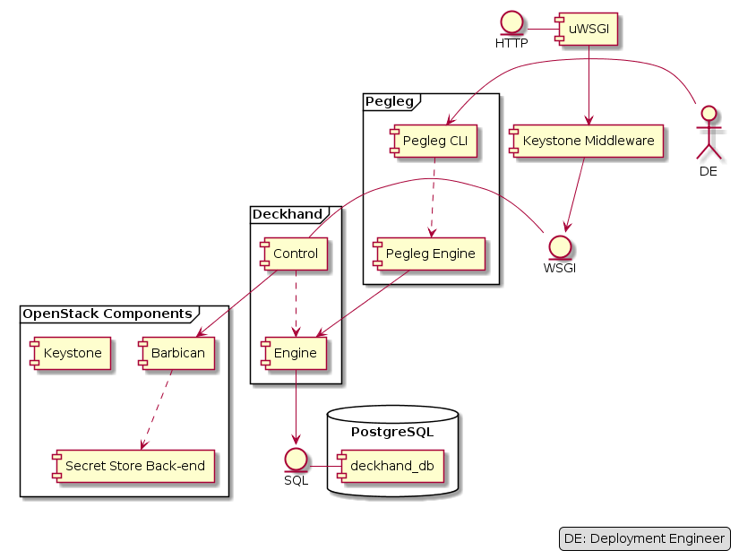

..
      Copyright 2018 AT&T Intellectual Property.
      All Rights Reserved.

      Licensed under the Apache License, Version 2.0 (the "License"); you may
      not use this file except in compliance with the License. You may obtain
      a copy of the License at

          http://www.apache.org/licenses/LICENSE-2.0

      Unless required by applicable law or agreed to in writing, software
      distributed under the License is distributed on an "AS IS" BASIS, WITHOUT
      WARRANTIES OR CONDITIONS OF ANY KIND, either express or implied. See the
      License for the specific language governing permissions and limitations
      under the License.

==============================
Developer Overview of Deckhand
==============================

The core objective of Deckhand is to provide storage, rendering, validation and
version control for declarative YAML documents. Deckhand ingests raw,
Airship-formatted documents and outputs fully rendered documents to other
Airship components.

Architecture
============

.. image:: images/architecture.png
   :alt: High level architecture of Deckhand

From a high-level perspective, Deckhand consists of a RESTful API, a document
rendering engine, and a PostgreSQL relational database for document storage.
Deckhand ingests Airship-formatted documents, validates them, and stores them
in its database for future processing. On demand, Deckhand will fully render
the documents, after which they can be consumed by the other Airship
components.

Deckhand uses Barbican to securely storage sensitive document data.

`Pegleg <https://airship-pegleg.readthedocs.io/>`_ in effect provides
Deckhand with a CLI, which facilitates communication with Deckhand.

Components
==========

control
-------

The ``control`` module is simply the RESTful API. It is based on the
`Falcon Framework <https://falconframework.org/>`_ and utilizes
`oslo.policy <https://docs.openstack.org/oslo.policy/latest/>`_
for RBAC enforcement of the API endpoints. The normal deployment of Deckhand
uses `uWSGI <http://uwsgi-docs.readthedocs.io/>`_ and PasteDeploy
to build a pipeline that includes Keystone Middleware for authentication
and role decoration of the request.

The ``control`` module is also responsible for communicating with
`Barbican <https://docs.openstack.org/barbican/latest/>`_, which it uses to
store and retrieve document :ref:`secrets <encryption>`, which it passes to the
``engine`` module for :ref:`rendering`.

engine
------

The ``engine`` module is the interface responsible for all
:ref:`rendering`. Rendering consists of applying a series of algorithms to the
documents, including: topological sorting, :ref:`layering`,
:ref:`substitution`, and :ref:`replacement`. This module also realizes
revision-diffing and revision-deepdiffing functionality.

db
--

The ``db`` module is responsible for implementing the database tables needed
to store all Airship documents. This module also realizes version control.

client
------

The API client library provides an interface for other services to communicate
with Deckhand's API. Requires
`Keystone <https://docs.openstack.org/keystone/latest/>`_ authentication to
use.

Developer Workflow
==================

Because Airship is a container-centric platform, the developer workflow heavily
utilizes containers for testing and publishing. It also requires Deckhand to
produce multiple artifacts that are related, but separate: the Python package,
the Docker image and the Helm chart. The code is published via the
Docker image artifact.

Deckhand strives to conform to the
`Airship coding conventions <https://airshipit.readthedocs.io/en/latest/conventions.html>`_.

Python
------

The Deckhand code base lives under ``/deckhand``. Deckhand supports py27
and py35 interpreters. Once OpenStack deprecates usage of py27, Deckhand
will as well.

See :ref:`coding-guide` for more information on contribution guidelines.

Docker
------

The Deckhand Dockerfile is located in ``/images/deckhand`` along with any
artifacts built specifically to enable the container image. Make targets are
used for generating and testing the artifacts.

* ``make images`` - Build the Deckhand Docker image.

Helm
----

The Deckhand Helm chart is located in ``/charts/deckhand``. Local testing
currently only supports linting and previewing the rendered artifacts.
Richer functional chart testing is a TODO.

* ``make charts`` - Pull down dependencies for the Deckhand charts and package
  everything into a ``.tgz`` file.
* ``make helm_lint`` - Lint the Helm charts.
* ``make dry-run`` - Render the chart and output the Kubernetes manifest YAML
  documents.

Testing
=======

All Deckhand tests are nested under ``/deckhand/tests``.

Deckhand comes equipped with a number of
`tox <https://tox.readthedocs.io/>`_ targets for running unit and
functional tests. See :ref:`development-utilities` for a list of commands.

See :ref:`testing` for more information on testing guidelines.
